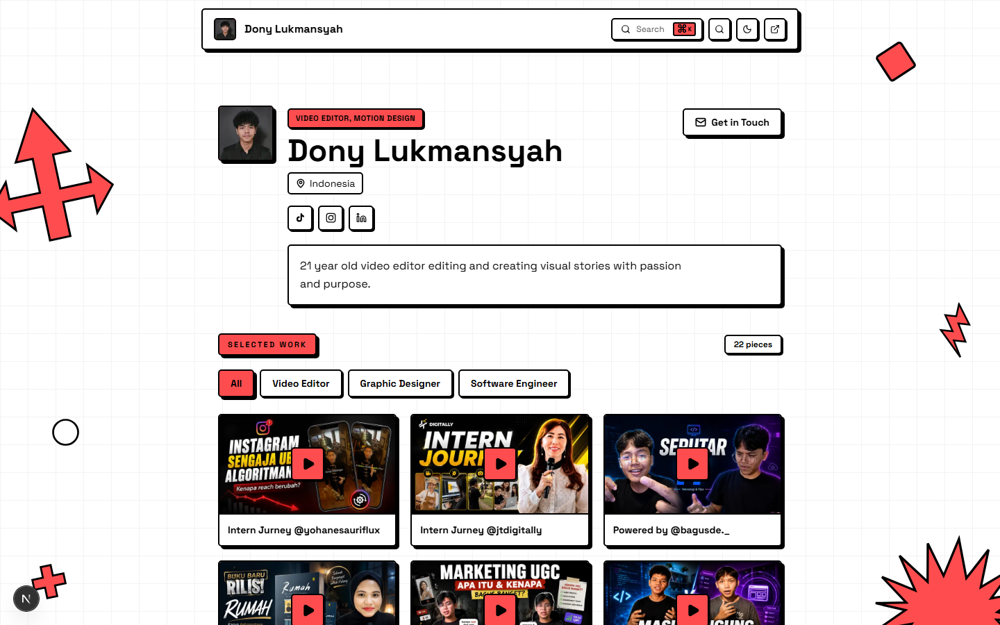
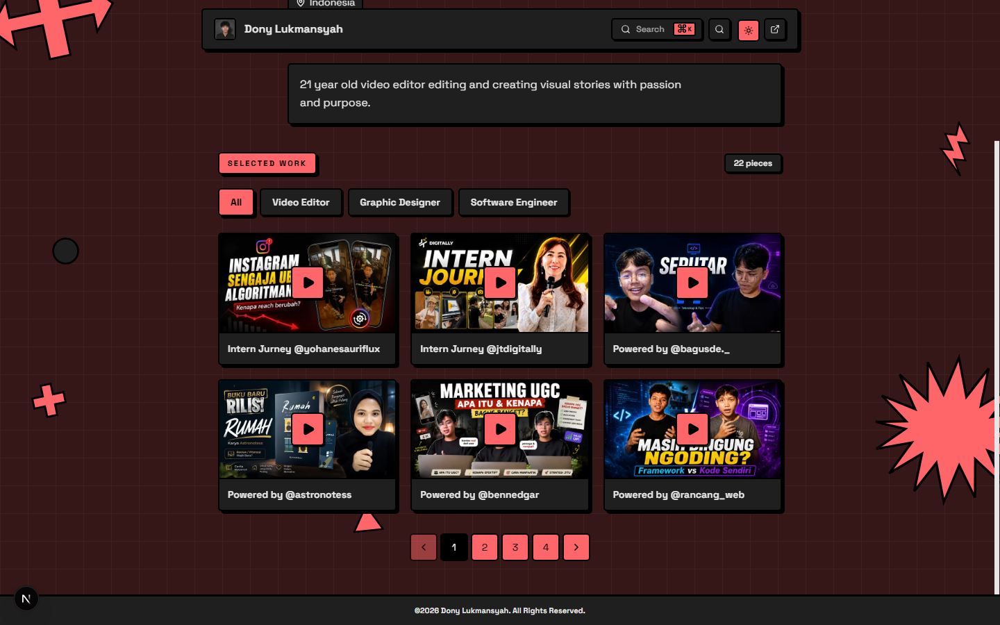
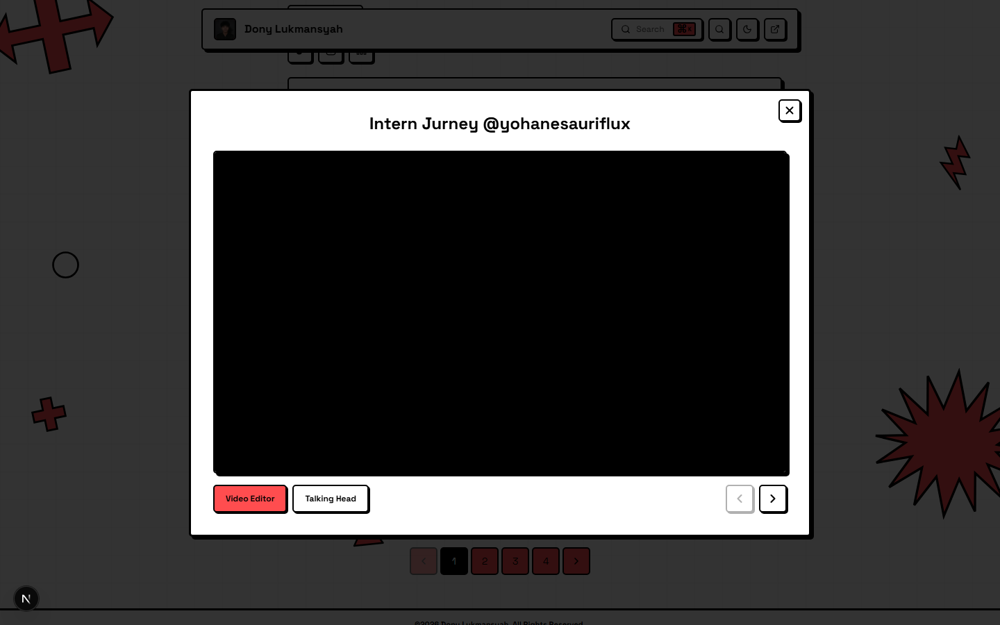
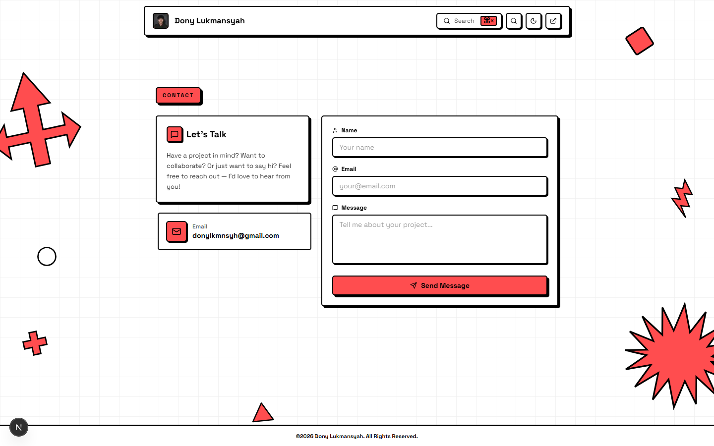
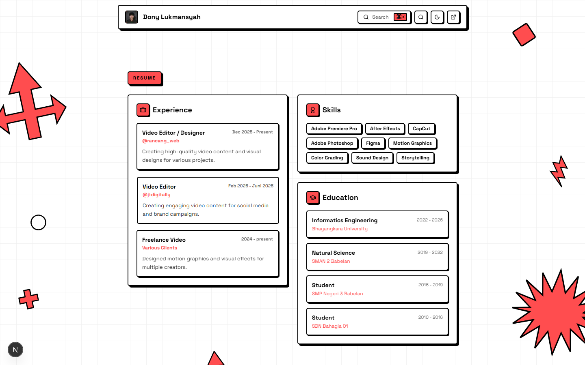

<div align="center">

# 🎬 Dony Lukmansyah — Portfolio

**Fullstack portfolio for a Video Editor & Motion Designer** — neobrutalism UI, smooth animations, and a secure admin dashboard to manage everything from one place.


</div>

## 📸 Screenshots

| Light mode | Dark mode |
|---|---|
|  |  |

| Portfolio detail | Contact | Resume |
|---|---|---|
|  |  |  |

## ✨ Features

- **Neobrutalism design** — chunky borders, hard shadows, bold colors, playful press animations
- **Dark / light mode** — persisted preference with a circle-reveal View Transition
- **Project showcase** — animated portfolio cards with image and embedded YouTube video support
- **Multi-level filtering** — main category → sub-category with client-side transitions and pagination
- **Admin dashboard** — full CRUD for portfolio items, categories (main/sub), and contact inbox
- **Contact form** — honeypot, rate limiting, and device fingerprinting against spam
- **Search** — Cmd/Ctrl+K command palette to jump straight to any project
- **Share modal** — QR code + copy-to-clipboard short link
- **Reduced motion support** — `prefers-reduced-motion` respected across all animations
- **SEO ready** — metadata, sitemap, robots.txt, OG/Twitter images

## 🛠️ Tech Stack

| Layer | Tech |
|---|---|
| Framework | Next.js (App Router, `src/` feature-based) |
| Language | TypeScript |
| Styling | Tailwind CSS v4, shadcn/ui + Radix UI, tw-animate-css |
| Database | PostgreSQL (Supabase), Prisma 7 |
| Auth | Better Auth (email/password, DB-backed rate limiting) |
| Storage | Supabase Storage (server-side, service role) |
| Validation | Zod |
| Icons | lucide-react |

## 🚀 Getting Started

### Prerequisites

- Node.js 20+
- A Supabase project (Postgres + Storage)
- pnpm (or npm)

### 1. Install

```bash
git clone https://github.com/donylukmansyah/portfolio-fullstack-video-editor.git
cd portfolio-fullstack-video-editor
pnpm install
```

### 2. Environment Variables

```bash
cp .env.example .env
```

Fill in the required values:

| Variable | Description |
|---|---|
| `DATABASE_URL` | Supabase pooled connection string |
| `DIRECT_URL` | Supabase direct connection (for Prisma CLI) |
| `NEXT_PUBLIC_SUPABASE_URL` | Supabase project URL |
| `NEXT_PUBLIC_SUPABASE_PUBLISHABLE_KEY` | Supabase publishable key |
| `SUPABASE_SERVICE_ROLE_KEY` | Server-only key for storage uploads |
| `BETTER_AUTH_SECRET` | 32-char random secret |
| `BETTER_AUTH_URL` | `http://localhost:3000` (dev) / your production URL |
| `NEXT_PUBLIC_SITE_URL` | Production URL |
| `ADMIN_EMAIL` / `ADMIN_PASSWORD` | Initial admin credentials |
| `ENABLE_ADMIN_BOOTSTRAP` | `true` during setup, **disable in production** |

### 3. Database

```bash
pnpm db:generate
pnpm db:migrate        # dev
pnpm db:migrate deploy # existing deployment
```

### 4. Run

```bash
pnpm dev        # http://localhost:3000
pnpm build      # production build
pnpm start      # serve production build
pnpm lint       # eslint
```

### 5. Create the admin account

With `ENABLE_ADMIN_BOOTSTRAP="true"`, POST to `/api/admin/bootstrap` with `{ "email": "ADMIN_EMAIL", "password": "ADMIN_PASSWORD" }`, then log in at `/admin`.

## 📁 Project Structure

Feature-based App Router architecture — everything a domain needs lives in its own folder:

```
src/
├── app/          # Route tree only (pages call feature modules)
├── components/   # ui/ (shadcn primitives) + layout/ (Navbar, PublicShell, Footer)
├── features/     # portfolio, admin, contact, resume, auth
│   └── <domain>/ # types.ts, schema.ts, server/, actions/, components/, hooks/
├── server/       # infra adapters (better-auth, prisma, supabase storage, cache tags)
├── shared/       # cross-cutting hooks & utils
└── proxy.ts      # middleware (admin route guard)
```

## 🔒 Security

- Triple admin guard: middleware matcher + session check + per-action assertion
- Server-only env secrets (`server-only` import), service-role key never reaches the client
- CSP, HSTS, and other security headers via `next.config.ts`
- Constant-time admin bootstrap comparison + disabled by default in production
- Spam protection on the contact form (honeypot, rate limit, fingerprint)

## 📜 License

MIT — free to use, clone, and remix. See [LICENSE](LICENSE).

---

<p align="center">Built with ❤️ by <a href="https://github.com/donylukmansyah">Dony Lukmansyah</a></p>